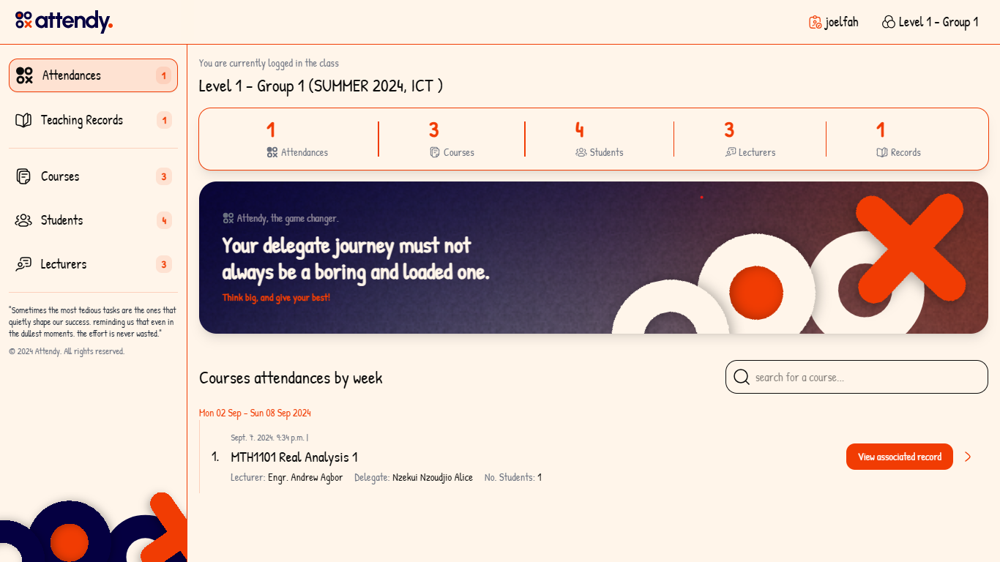

# **Attendy**

Welcome to **Attendy**, a web application designed to make student attendance management seamless and efficient. Whether you're a student, educator, or administrator, Attendy simplifies tracking attendance, organizing courses, and managing student records.

**GitHub Repository**: [Attendy on GitHub](https://github.com/Joel-Fah/attendy)


## **Project Overview**

Attendy is built with the goal of providing a user-friendly platform for educational institutions to manage attendance across various courses. The platform is feature-rich, offering a dashboard for quick overviews, tools for managing courses, students, lecturers, and detailed logs for teaching sessions.


## **Features**

- **Dashboard**: Get a comprehensive overview of attendance across all your courses.
- **Course Management**: Organize and track attendance for each course.
- **Student Management**: Maintain detailed records of student attendance.
- **Lecturers Management**: Empower lecturers to manage class attendance easily.
- **Teaching Records Management**: Log and track teaching sessions and attendance data.
- 


## **Project Setup**

### **Prerequisites**

- Python 3.x
- pip (Python package installer)
- Git

### **Setup on Windows**

1. **Clone the Repository**:

    ```bash
    git clone https://github.com/Joel-Fah/attendy.git
    cd attendy
    ```

2. **Create a Virtual Environment**:

    ```bash
    python -m venv venv
    ```

3. **Activate the Virtual Environment**:

    ```bash
    venv\Scripts\activate
    ```

4. **Install the Dependencies**:

    ```bash
    pip install -r requirements.txt
    ```

5. **Setup the Database**:
    - For **SQLite** (default):
      ```bash
      python manage.py migrate
      ```
    - For **PostgreSQL**:
      - Ensure PostgreSQL is installed and a database is created.
      - Update the `DATABASES` settings in `settings.py` with your PostgreSQL credentials.
      - Run migrations:
        ```bash
        python manage.py migrate
        ```

6. **Run the Development Server**:

    ```bash
    python manage.py runserver
    ```

### **Setup on Linux**

1. **Clone the Repository**:

    ```bash
    git clone https://github.com/Joel-Fah/attendy.git
    cd attendy
    ```

2. **Create a Virtual Environment**:

    ```bash
    python3 -m venv venv
    ```

3. **Activate the Virtual Environment**:

    ```bash
    source venv/bin/activate
    ```

4. **Install the Dependencies**:

    ```bash
    pip install -r requirements.txt
    ```

5. **Setup the Database**:
    - For **SQLite** (default):
      ```bash
      python3 manage.py migrate
      ```
    - For **PostgreSQL**:
      - Ensure PostgreSQL is installed and a database is created.
      - Update the `DATABASES` settings in `settings.py` with your PostgreSQL credentials.
      - Run migrations:
        ```bash
        python3 manage.py migrate
        ```

6. **Run the Development Server**:

    ```bash
    python3 manage.py runserver
    ```

### **Accessing Attendy**

After setting up the project, access the application by navigating to `http://127.0.0.1:8000/` or `localhost:8000` in your web browser.

## **Contributing**

We welcome contributions from the community! Whether it's reporting bugs, suggesting features, or submitting pull requests, your involvement is crucial to the project's growth. Please read our [Code of Conduct](./CODE_OF_CONDUCT.md) before contributing.

## **License**

This project is licensed under the MIT License - see the [LICENSE](./LICENSE) file for details.

## **Contact**

For questions, suggestions, or feedback, feel free to open an issue or reach out via the repository's contact links.

Thank you for checking out Attendy!


Thank you for helping us maintain a positive and inclusive community!

